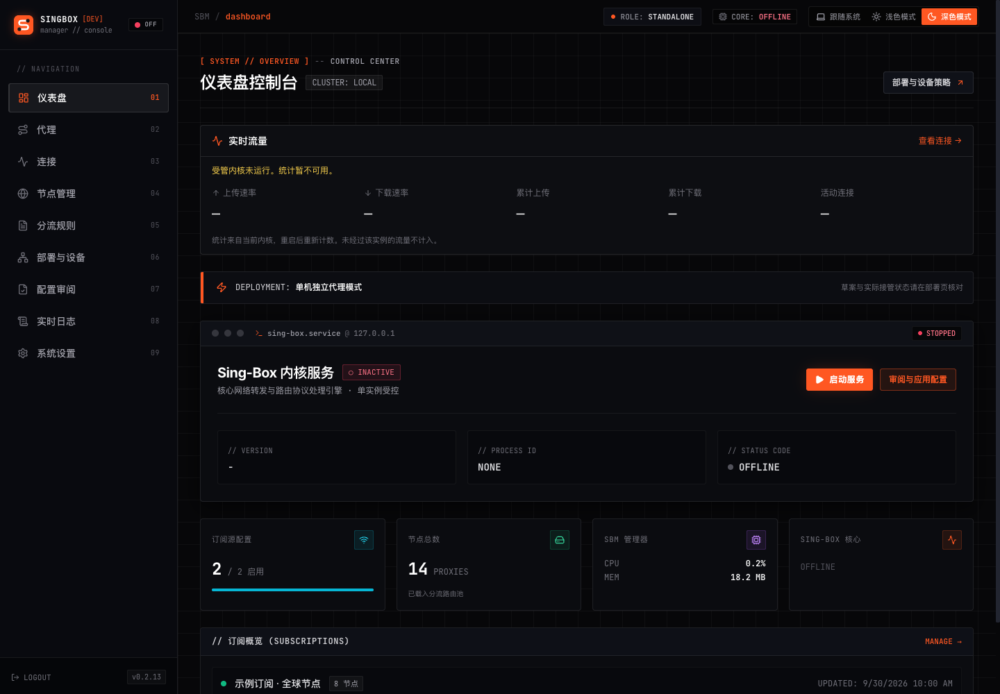
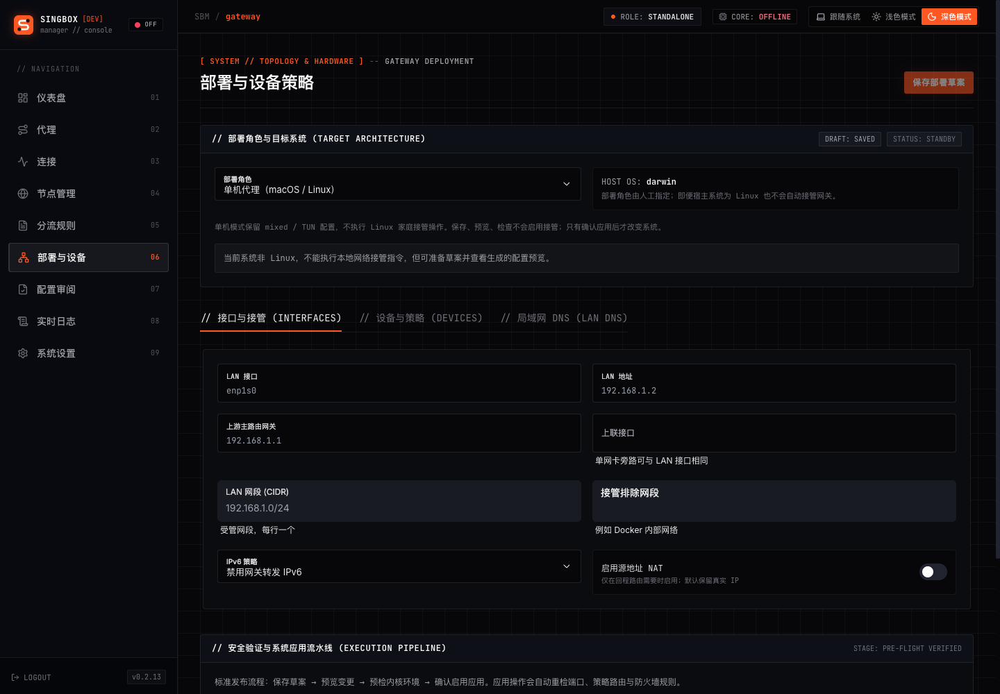
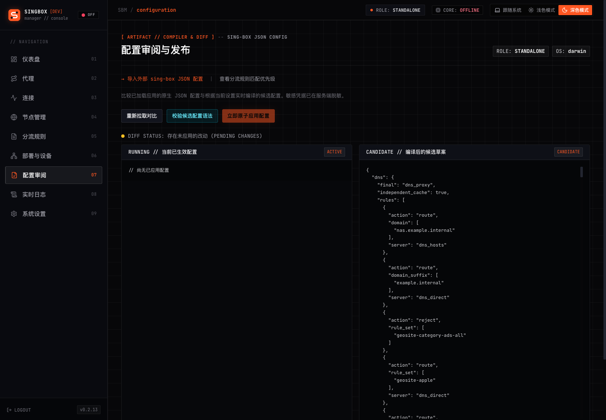
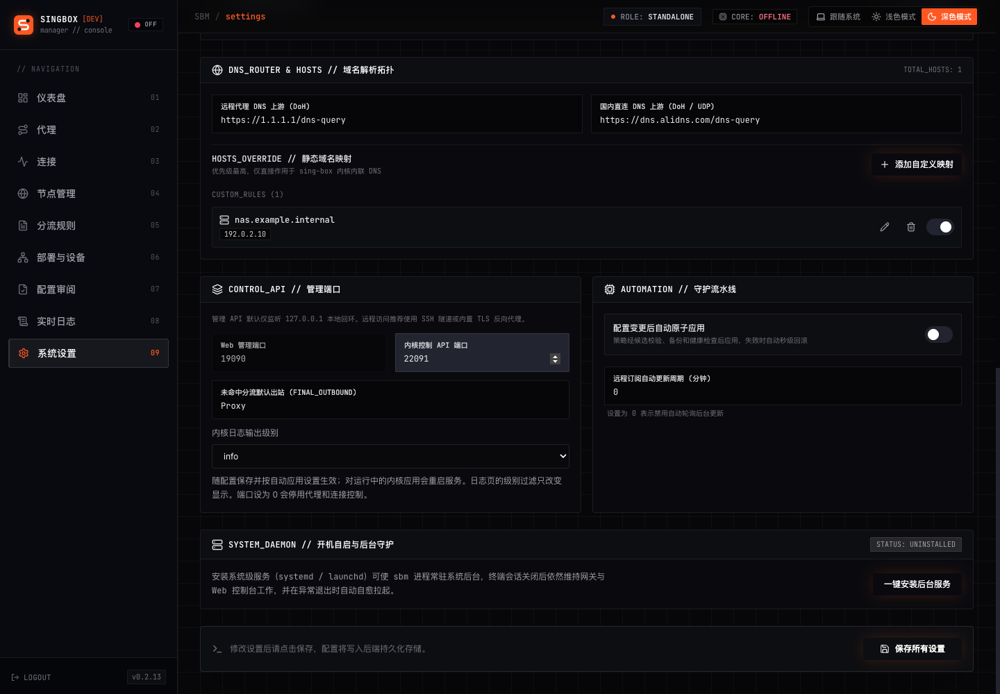
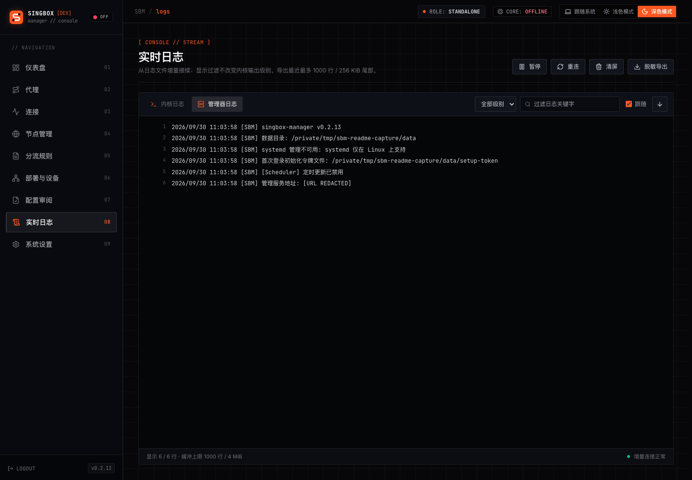
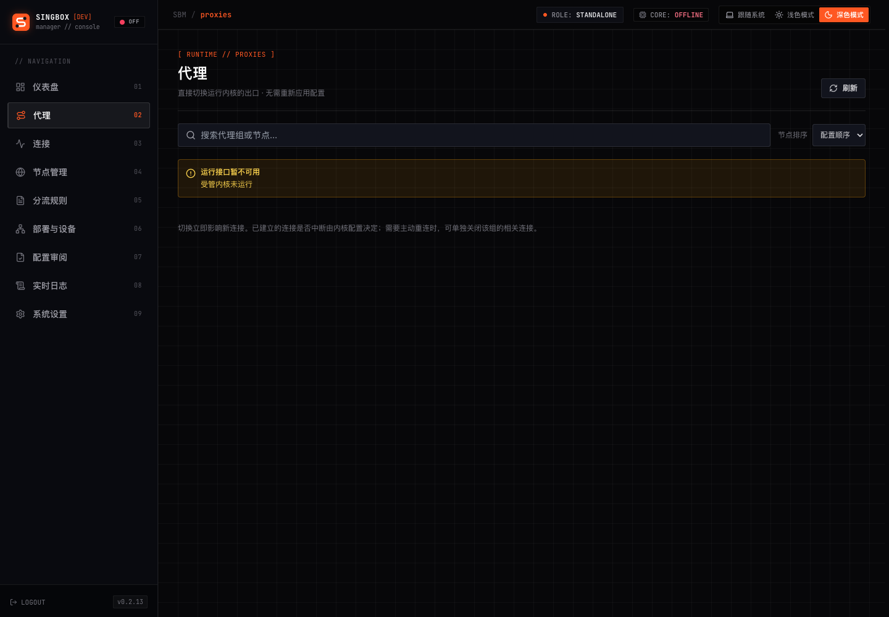
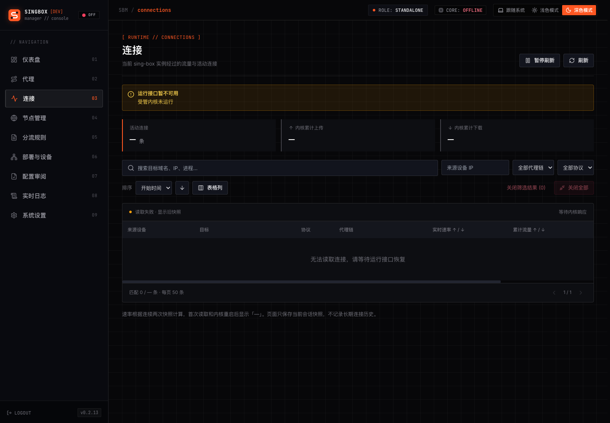

# singbox-manager


[English](#english) | [中文](#中文)

---

<a name="english"></a>

## English

A web-based management panel for [sing-box](https://github.com/SagerNet/sing-box), combining subscriptions, routing rules, live proxy control, connections, logs, and configuration review. Supports standalone macOS / Linux installations and Linux home-network deployments through DNS bypass or full gateway mode.

### Features

- **Subscription Management**
  - Support multiple formats: SS, VMess, VLESS, Trojan, Hysteria2, TUIC, SOCKS
  - Clash YAML and Base64 encoded subscriptions
  - Traffic statistics (used/remaining/total)
  - Expiration date tracking
  - Auto-refresh with configurable intervals

- **Node Management**
  - Auto-parse nodes from subscriptions
  - Manual node addition
  - Country grouping with emoji flags
  - Node filtering by keywords and countries

- **Rule Configuration**
  - Custom rules (domain, IP, port, geosite, geoip)
  - 13 preset rule groups (Ads, AI services, streaming, etc.)
  - Combine source IP / CIDR, destination, TCP / UDP, sniffed protocol, and port conditions; control rule priority
  - Editable rules, imported policies, device policies, and generated route order
  - Separate draft and applied configuration views
  - Optional source-scoped STUN rules to proxy or reject matching traffic without forcing the entire device through a proxy
  - Rule set validation tool

- **Configuration Review and Import**
  - Redacted draft / applied configuration comparison, candidate validation, and current / previous version hashes
  - Validate with `sing-box check` before applying; back up, atomically replace, and check the running instance after restart, with recovery on failure
  - Restore the previous configuration; auto-apply is disabled after restoration to prevent immediate overwrite
  - Import final sing-box JSON from any source, including a `config` wrapper; preview retained policies, excluded runtime settings, and blocking incompatibilities
  - Preserve outbound references, imported rule order, DNS / hosts, and rule sets; save a pre-import recovery point
  - After confirmation, import replaces the existing imported policy and clears editable rules, preset rule groups, and filters; the original draft remains in the recovery point
  - Import saves a standalone draft with auto-apply and TUN disabled; review and apply it separately

- **Filter System**
  - Include/exclude by keywords
  - Country-based filtering
  - Proxy modes: URL-test (auto) / Select (manual)

- **DNS Management**
  - UDP, TCP, TLS, HTTPS, QUIC, and HTTP/3 upstreams, with separate direct / proxy resolvers
  - Custom hosts, Split DNS, and device source policies
  - DNS bypass returns real addresses for direct domains and IPv4 FakeIP for proxy domains, with persistent FakeIP mappings

- **Deployment and Device Policies**
  - Standalone, Linux DNS bypass, and Linux full gateway modes with explicit activation
  - Group devices by source IP / CIDR: split routing, strict proxy, direct, or bypass; DNS bypass rejects strict proxy groups
  - Gateway preview, conflict checks, apply, status, and recovery through a dedicated privileged helper
  - Full gateway supports optional IPv4 NAT, DHCP reservations, and IPv6 policies; NAT and DHCP are disabled by default

- **Built-in Proxy and Connection Panel**
  - Read live proxy groups and selection chains; switch selector members without applying configuration or restarting the core
  - Test individual nodes or whole groups; search, sort, collapse, and hide groups
  - Inspect active connections by source, destination, proxy chain, and protocol, with traffic / speed sorting, details, and pagination
  - Close individual connections, filtered results, all captured connections, or connections for a proxy group after confirmation
  - Show upload / download rates, cumulative traffic, and active connection counts for the current core
  - Use the authenticated management service; no separate dashboard or browser-side Clash API credentials required

- **Login and Access Control**
  - First-run setup token, password login, session authentication, and login rate limiting
  - Listen on `127.0.0.1` by default; non-loopback management access requires HTTPS and supports source CIDR restrictions
  - Redact sensitive values in configuration previews and logs

- **Service Control**
  - Start/Stop/Restart sing-box
  - Optional auto-apply for configuration changes, using the same validation and recovery workflow as manual apply
  - Recover matching managed processes on startup; prevent duplicate managers from sharing a data directory

- **Monitoring and Incremental Logs**
  - Real-time CPU and memory usage
  - Application and sing-box logs via SSE, with cursor-based resume and log rotation support
  - Filter by source, level, and keyword; pause, resume, follow, and clear the display
  - Redacted export of up to 1,000 recent lines (256 KiB tail-read limit); clearing the display does not delete log files

- **Platform and Kernel Management**
  - macOS launchd and Linux systemd integration for background service management
  - Download sing-box, check versions, and validate candidate binaries against the current configuration before replacing the core
  - Keep the previous binary and recover from failed replacement / health checks
  - Linux / macOS, amd64 / arm64 builds with an embedded frontend

- **Interface and Preferences**
  - Light, dark, and system themes; responsive navigation, shared confirmation dialogs, and project icons
  - Browser-local preferences for refresh interval, node sorting, latency test URL / timeout, connection columns / widths, and log buffer / follow behavior

### Deployment Modes

| Mode | Platform | Traffic path and prerequisites |
|------|----------|--------------------------------|
| Standalone (`desktop`) | macOS / Linux | Local mixed proxy, optional LAN proxy access, and optional TUN |
| DNS bypass (`gateway`, `access_mode=dns`) | Linux | Router distributes the bypass DNS address and routes the FakeIP subnet to this host; clients keep the main router as their default gateway |
| Full gateway (`gateway`, `access_mode=full`) | Linux | Clients route through this host; dedicated LAN DNS and TUN handle gateway traffic |

**DNS bypass requires both router-side DNS distribution and a FakeIP static route.** It does not capture all traffic: direct-IP access, application DoH, and IPv6 may bypass it. Proxy domains receive IPv4 FakeIP only for A queries; non-A queries return empty answers. Device-specific DNS policies require preserving the original client source address.

Existing standalone installations remain standalone; existing `gateway` configurations without `access_mode` retain full gateway behavior. Saving a draft does not activate gateway mode. Following a host reboot, gateway takeover requires recovery, checks, and explicit re-application.

Connection statistics and STUN rules only cover traffic that actually passes through this instance. Runtime controls require the core's Clash API; setting the control port to `0` disables them. See the guides below for deployment and migration details.

### Documentation

| Guide | Contents |
|-------|----------|
| [Deployment, login, and configuration](docs/deployment-modes.md) | Authentication, HTTPS, device policies, configuration import, validation, and recovery |
| [Mac mini / macOS deployment](docs/macos.md) | Native HTTP/SOCKS proxy, local TUN, and the Linux gateway boundary |
| [DNS bypass](docs/dns-bypass.md) | Router DNS / static routes, FakeIP, source identity, and verification |
| [Linux gateway](docs/linux-gateway.md) | Helper installation, system permissions, conflict checks, DHCP / NAT, and recovery |
| [Built-in runtime panel](docs/builtin-panel.md) | Proxy switching, connections, traffic, incremental logs, and migration from external dashboards |

### Screenshots

Captured from the current source on September 30, 2026, using the dark theme at 1440 × 1000. Subscriptions, nodes, rules, and hosts use demonstration data in an isolated local instance on macOS. The sing-box core is not installed or running, so runtime pages show their unavailable state; these screenshots do not demonstrate live proxy traffic.

**Dashboard**



**Nodes and subscriptions**


**Routing rules**


**Deployment and devices**



**Configuration review**



**System settings**


**DNS and hosts**



**Live logs**



**Proxies (core stopped)**



**Connections (core stopped)**



### Installation

#### Pre-built Binaries

Download from [Releases](https://github.com/williamnie/singbox-manager/releases) page.

#### Build from Source

```bash
# Clone the repository
git clone https://github.com/williamnie/singbox-manager.git
cd singbox-manager

# Build for all platforms
./build.sh all

# Or build for current platform only
./build.sh current

# Output binaries are in ./dist/
# After building for the current platform:
./dist/sbm
```

**Build Options:**

```bash
./build.sh all       # Build for all platforms (Linux/macOS x amd64/arm64)
./build.sh linux     # Build for Linux only
./build.sh darwin    # Build for macOS only
./build.sh current   # Build for current platform
./build.sh frontend  # Build frontend only
./build.sh clean     # Clean build directory
```

The script reuses `web/dist` if it already exists. After frontend changes, run `./build.sh frontend` before rebuilding the binary. Linux home-network deployments also require `sbm-gateway`; follow the [gateway installation guide](docs/linux-gateway.md#初始化).

### Usage

```bash
# Basic usage
./sbm

# Custom data directory and port
./sbm -data ~/.singbox-manager -port 9090
```

#### First Login

1. Open `http://127.0.0.1:9090` after starting the manager.
2. On first startup, including the first upgrade to authentication, read the `setup-token` file in the selected data directory. For the default directory, run this in another terminal:

   ```bash
   cat ~/.singbox-manager/setup-token
   ```

3. Enter the token and set a management password of 12–72 bytes. The setup token is removed after initialization; subsequent logins use the password.
4. Add subscriptions or import a sing-box JSON draft, install the core in settings, then review, validate, and apply the configuration. Applying a standalone configuration while the core is stopped does not start it; use the service start control afterward.

For remote management, forward the local-only interface over SSH and open `http://127.0.0.1:19090`:

```bash
ssh -L 19090:127.0.0.1:9090 user@gateway-host
```

**Command Line Options:**

| Option | Default | Description |
|--------|---------|-------------|
| `-data` | `~/.singbox-manager` | Data directory path |
| `-port` | `9090` | Web server port |
| `-listen` | `127.0.0.1` | Management listening IP; non-loopback addresses require TLS |
| `-tls-cert` | Empty | Management HTTPS certificate path; use together with `-tls-key` |
| `-tls-key` | Empty | Management HTTPS private key path |
| `-allow-network` | Empty | Comma-separated source CIDRs; empty adds no source restriction, and loopback remains allowed |

For direct LAN management, explicitly configure a listening IP, TLS certificate / key, and source CIDRs as described in the [deployment guide](docs/deployment-modes.md). Each instance must use a separate data directory and non-conflicting ports.

### Configuration

**Data Directory Structure:**

```text
~/.singbox-manager/
├── data.json           # Configuration data
├── auth.json           # Management password hash
├── setup-token         # First-run token; removed after initialization
├── migration-before.json # Pre-import recovery point, when available
├── generated/
│   ├── config.json     # Applied sing-box config
│   └── config.json.previous # Previous config, when available
├── bin/
│   ├── sing-box        # sing-box binary
│   └── sing-box.previous # Previous binary, when available
├── logs/
│   ├── sbm.log         # Application logs
│   └── singbox.log     # sing-box logs
├── manager.lock        # Data-directory instance lock
└── singbox.pid         # PID file
```

This lists the main files, not an exhaustive inventory. Configuration / import backups may contain credentials and should be kept private.

### Tech Stack

- **Backend:** Go, Gin, gopsutil
- **Frontend:** React 19, TypeScript, NextUI, Tailwind CSS
- **Build:** Single binary with embedded frontend

### Requirements

- Go 1.23.0+ (module requirement; `go.mod` selects toolchain `go1.24.10`)
- Node.js 20.x (20.9+) or 22+, with npm or pnpm (for building frontend)
- sing-box (auto-downloaded or manual installation)
- Linux home-network modes require sing-box 1.14 or a newer supported 1.x release, the privileged helper, and the system tools listed in the [gateway guide](docs/linux-gateway.md#初始化); the target core must pass configuration validation

### License

MIT License

---

<a name="中文"></a>

## 中文

一个集订阅、分流规则、代理热切换、连接管理、日志和配置审阅于一体的 [sing-box](https://github.com/SagerNet/sing-box) Web 管理面板。支持 macOS / Linux 单机部署，以及 Linux 家庭网络的 DNS 分流旁路和完整网关接管。

### 功能特性

- **订阅管理**
  - 支持多种格式：SS、VMess、VLESS、Trojan、Hysteria2、TUIC、SOCKS
  - 兼容 Clash YAML 和 Base64 编码订阅
  - 流量统计（已用/剩余/总量）
  - 过期时间追踪
  - 可配置间隔的自动刷新

- **节点管理**
  - 自动从订阅解析节点
  - 手动添加节点
  - 按国家分组（带 emoji 国旗）
  - 按关键字和国家过滤节点

- **规则配置**
  - 自定义规则（域名、IP、端口、geosite、geoip）
  - 13 个预设规则组（广告、AI 服务、流媒体等）
  - 联合匹配来源 IP / CIDR、目的条件、TCP / UDP、嗅探协议和端口，支持规则优先级
  - 查看可编辑规则、导入策略、设备策略和生成路由次序
  - 区分草案与已应用配置
  - 可按设备来源添加 STUN 代理或拒绝规则，无需将整台设备设为全代理
  - 规则集验证工具

- **配置审阅与导入**
  - 脱敏对比草案与已应用配置，校验候选配置，查看当前及前一版本摘要
  - 应用前执行 `sing-box check`，备份后原子替换；运行中的实例重启并检查健康状态，失败时恢复
  - 支持恢复前一版配置，恢复后关闭自动应用，避免立即被草案覆盖
  - 导入任意来源的最终 sing-box JSON，兼容 `config` 包装；预览保留策略、不导入的运行态设置及不兼容项
  - 保留出站引用、导入规则次序、DNS / hosts 和规则集，导入前保存完整恢复点
  - 确认导入会替换现有导入策略，并清空可编辑规则、预设规则组和筛选组；原草案保留在恢复点中
  - 导入先保存为单机草案，并关闭自动应用和 TUN，审阅后另行应用

- **过滤器系统**
  - 按关键字包含/排除
  - 按国家过滤
  - 代理模式：自动测速 / 手动选择

- **DNS 管理**
  - 支持 UDP、TCP、TLS、HTTPS、QUIC、HTTP/3 上游，分别配置直连与代理 DNS
  - 自定义 hosts、Split DNS 和设备来源策略
  - DNS 旁路为直连域名返回真实地址、为代理域名返回 IPv4 FakeIP，并持久化 FakeIP 映射

- **部署与设备策略**
  - 单机、Linux DNS 分流旁路、Linux 完整网关三种模式，显式启用接管
  - 按来源 IP / CIDR 管理设备和分组：普通分流、严格全代理、直连、绕过；DNS 旁路拒绝严格全代理组
  - 通过独立特权辅助服务执行网关预览、冲突检查、应用、状态查询和恢复
  - 完整网关可选 IPv4 NAT、DHCP 保留地址与 IPv6 策略，NAT 和 DHCP 默认关闭

- **内置代理与连接面板**
  - 读取运行内核的代理组和选择链，手动选择组可热切换节点，无需应用配置或重启内核
  - 支持单节点 / 整组测速，以及搜索、排序、折叠和隐藏代理组
  - 按来源、目标、代理链和协议筛选活动连接，支持流量 / 速率排序、详情与分页
  - 确认后关闭单条连接、筛选结果、捕获的全部连接或某代理组连接
  - 展示当前内核的上传 / 下载速率、累计流量和活动连接数
  - 统一通过已登录的管理服务访问，无需额外面板或在浏览器填写 Clash API 密钥

- **登录与访问控制**
  - 首次设置令牌、密码登录、会话鉴权与登录失败限速
  - 默认仅监听 `127.0.0.1`；非回环管理访问必须启用 HTTPS，可限制来源 CIDR
  - 配置预览与日志中的敏感信息脱敏

- **服务控制**
  - 启动/停止/重启 sing-box
  - 可选配置变更后自动应用，与手动应用共用校验和失败恢复流程
  - 启动时恢复身份匹配的受管进程，数据目录排他锁阻止重复管理器实例

- **系统监控与增量日志**
  - 实时 CPU 和内存使用率
  - 通过 SSE 增量读取管理器和 sing-box 日志，支持游标接续和日志轮转
  - 按来源、级别、关键词筛选，支持暂停 / 恢复、跟随和清屏
  - 脱敏导出最近最多 1,000 行（尾部读取上限 256 KiB）；清屏只清显示，不删除日志文件

- **平台与内核管理**
  - macOS launchd、Linux systemd 后台服务管理
  - 下载 sing-box、检查版本，替换前验证候选内核及当前配置
  - 保留前一版本内核，替换或健康检查失败时恢复
  - 支持 Linux / macOS、amd64 / arm64 构建，前端内嵌于管理器二进制

- **界面与偏好**
  - 浅色、深色、跟随系统主题，响应式导航、统一确认弹窗和项目图标
  - 刷新频率、节点排序、测速地址 / 超时、连接列 / 列宽、日志缓存 / 跟随等偏好保存在浏览器

### 部署模式

| 模式 | 平台 | 流量路径与前提 |
|------|------|----------------|
| 单机（`desktop`） | macOS / Linux | 本机 mixed 代理，可选局域网代理访问和 TUN |
| DNS 分流旁路（`gateway`、`access_mode=dns`） | Linux | 主路由下发旁路 DNS，并将 FakeIP 网段路由到本机；终端默认网关保持主路由 |
| 完整网关接管（`gateway`、`access_mode=full`） | Linux | 终端默认路由经过本机，由独立 LAN DNS 与 TUN 接管网关流量 |

**DNS 旁路必须同时配置主路由下发 DNS 和 FakeIP 静态路由。** 它不接管所有流量：直接访问 IP、应用 DoH 和 IPv6 都可能绕过旁路。代理域名仅 A 查询返回 IPv4 FakeIP，非 A 查询返回空应答；按设备区分 DNS 策略还要求保留终端原始来源地址。

升级后旧单机仍为单机，未设置 `access_mode` 的旧 `gateway` 配置保持完整网关行为。保存草案不等于启用接管；主机重启后，网关接管需要恢复、检查并显式重新应用。

连接统计和 STUN 规则仅覆盖真正经过当前实例的流量。运行控制依赖内核 Clash API，将控制端口设为 `0` 会停用这些能力。具体部署与迁移步骤见下方文档。

### 详细文档

| 文档 | 内容 |
|------|------|
| [部署、登录与配置管理](docs/deployment-modes.md) | 登录鉴权、HTTPS、设备策略、配置导入、校验与恢复 |
| [Mac mini / macOS 部署](docs/macos.md) | 原生 HTTP/SOCKS 代理、本机 TUN 与 Linux 家庭网关的边界 |
| [DNS 分流旁路](docs/dns-bypass.md) | 主路由 DNS / 静态路由、FakeIP、来源识别与验收步骤 |
| [Linux 网关部署与恢复](docs/linux-gateway.md) | helper 安装、系统权限、冲突检查、DHCP / NAT 与恢复 |
| [内置运行面板](docs/builtin-panel.md) | 代理热切换、连接、流量、增量日志与外部面板迁移 |

### 截图

以下截图于 2026-09-30 从当前源码运行的界面拍摄，使用深色主题，分辨率为 1440 × 1000。截图来自 macOS 上的独立本地实例，订阅、节点、规则和 Hosts 使用演示数据。sing-box 内核未安装、未启动，因此运行面板展示不可用状态，不代表真实代理流量。

**仪表盘**


**节点与订阅管理**


**分流规则**


**部署与设备**


**配置审阅**


**系统设置**


**DNS 与 Hosts**


**实时日志**


**代理（内核未启动）**


**连接（内核未启动）**


### 安装

#### 预编译二进制文件

从 [Releases](https://github.com/williamnie/singbox-manager/releases) 页面下载。

#### 从源码构建

```bash
# 克隆仓库
git clone https://github.com/williamnie/singbox-manager.git
cd singbox-manager

# 构建所有平台
./build.sh all

# 或只构建当前平台
./build.sh current

# 输出文件在 ./dist/ 目录
# 构建当前平台后可直接运行：
./dist/sbm
```

**构建选项：**

```bash
./build.sh all       # 构建所有平台（Linux/macOS x amd64/arm64）
./build.sh linux     # 仅构建 Linux
./build.sh darwin    # 仅构建 macOS
./build.sh current   # 仅构建当前平台
./build.sh frontend  # 仅构建前端
./build.sh clean     # 清理构建目录
```

脚本会复用已有 `web/dist`。修改前端后，先运行 `./build.sh frontend`，再重新构建管理器。Linux 家庭接入还需构建并安装 `sbm-gateway`，步骤见[网关初始化说明](docs/linux-gateway.md#初始化)。

### 使用方法

```bash
# 基本用法
./sbm

# 自定义数据目录和端口
./sbm -data ~/.singbox-manager -port 9090
```

#### 首次登录

1. 启动管理器后打开 `http://127.0.0.1:9090`。
2. 首次启动（包括旧版本首次升级到带鉴权的版本）时，从所选数据目录读取 `setup-token`。默认目录可在另一个终端执行：

   ```bash
   cat ~/.singbox-manager/setup-token
   ```

3. 在页面输入令牌，设置 12–72 字节的管理密码。初始化完成后令牌文件会删除，之后使用密码登录。
4. 添加订阅或导入 sing-box JSON 草案，在设置页安装内核，再审阅、校验并应用配置。单机内核原本停止时，应用只更新配置，之后需手动启动服务。

远程管理可使用 SSH 转发本机管理端口，再打开 `http://127.0.0.1:19090`：

```bash
ssh -L 19090:127.0.0.1:9090 user@gateway-host
```

**命令行参数：**

| 参数 | 默认值 | 说明 |
|------|--------|------|
| `-data` | `~/.singbox-manager` | 数据目录路径 |
| `-port` | `9090` | Web 服务端口 |
| `-listen` | `127.0.0.1` | 管理监听 IP，非回环地址必须配置 TLS |
| `-tls-cert` | 空 | 管理服务 HTTPS 证书路径，与 `-tls-key` 同时配置 |
| `-tls-key` | 空 | 管理服务 HTTPS 私钥路径 |
| `-allow-network` | 空 | 逗号分隔的来源 CIDR；空值不附加来源限制，回环来源始终允许 |

需要直接从局域网访问时，按[部署说明](docs/deployment-modes.md)显式配置监听 IP、TLS 证书 / 私钥和来源范围。多实例必须使用独立数据目录和互不冲突的端口。

### 配置

**数据目录结构：**

```text
~/.singbox-manager/
├── data.json           # 配置数据
├── auth.json           # 管理密码摘要
├── setup-token         # 首次设置令牌，初始化后删除
├── migration-before.json # 导入前恢复点，按需生成
├── generated/
│   ├── config.json     # 已应用的 sing-box 配置
│   └── config.json.previous # 前一版配置，按需生成
├── bin/
│   ├── sing-box        # sing-box 二进制文件
│   └── sing-box.previous # 前一版内核，按需生成
├── logs/
│   ├── sbm.log         # 应用日志
│   └── singbox.log     # sing-box 日志
├── manager.lock        # 数据目录实例锁
└── singbox.pid         # PID 文件
```

以上列出主要文件，非完整清单。配置及导入备份可能包含凭据，应作为私有文件保管。

### 技术栈

- **后端：** Go、Gin、gopsutil
- **前端：** React 19、TypeScript、NextUI、Tailwind CSS
- **构建：** 单一二进制文件，内嵌前端

### 环境要求

- Go 1.23.0+（模块要求，`go.mod` 指定工具链 `go1.24.10`）
- Node.js 20.x（20.9+）或 22+，以及 npm 或 pnpm（用于构建前端）
- sing-box（可自动下载或手动安装）
- Linux 家庭接入要求 sing-box 1.14 或更新且受支持的 1.x 版本、特权 helper 及[网关文档](docs/linux-gateway.md#初始化)所列系统工具，生成配置仍需通过目标内核校验

### 许可证

MIT License
