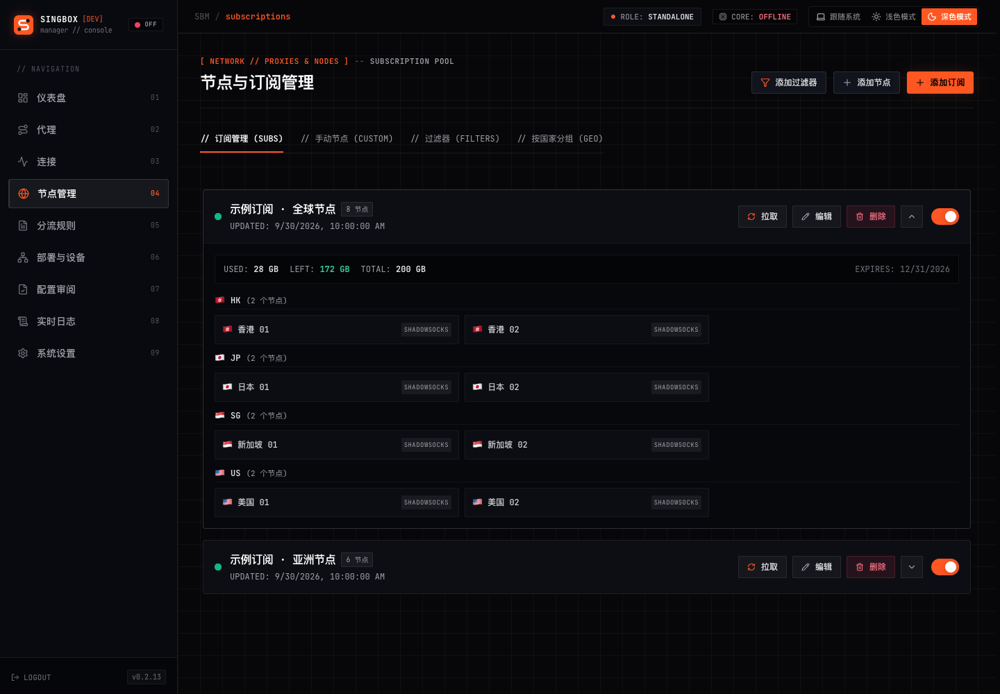
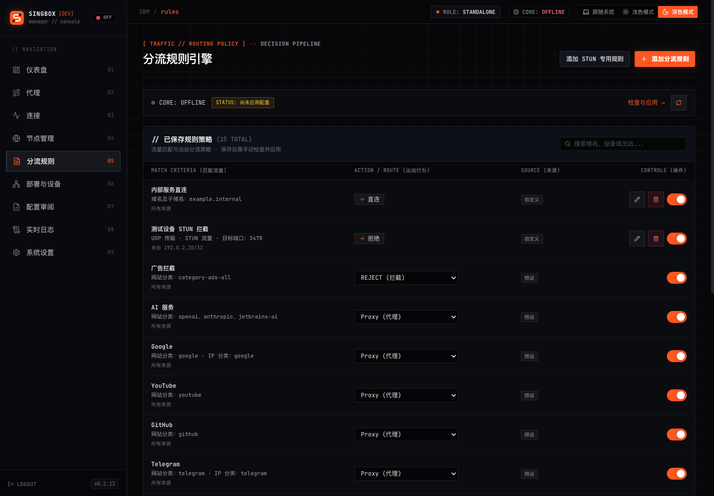
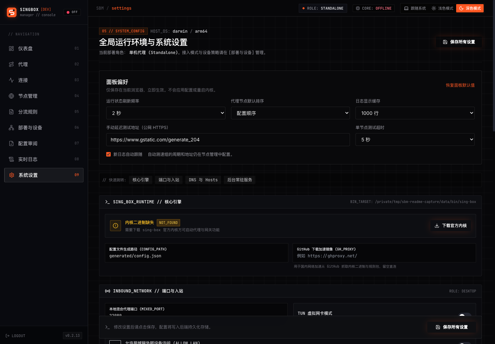

> 支持 macOS / Linux 单机，以及 Linux 家庭接入的“DNS 分流旁路”和“完整网关接管”。[DNS 分流旁路配置步骤](docs/dns-bypass.md)保留终端默认网关，主路由需下发旁路 DNS 并配置 FakeIP 静态路由。登录、配置导入与安全应用见[部署说明](docs/deployment-modes.md)；特权服务与恢复见[网关说明](docs/linux-gateway.md)。旧单机配置仍为单机，旧 `gateway` 配置仍为完整网关。默认管理地址为 `127.0.0.1`，首次登录读取数据目录的 `setup-token`。

# singbox-manager

[English](#english) | [中文](#中文)

---

<a name="english"></a>

## English

A modern web-based management panel for [sing-box](https://github.com/SagerNet/sing-box), providing an intuitive interface to manage subscriptions, rules, filters, and more.

### Features

- **Subscription Management**
  - Support multiple formats: SS, VMess, VLESS, Trojan, Hysteria2, TUIC
  - Clash YAML and Base64 encoded subscriptions
  - Traffic statistics (used/remaining/total)
  - Expiration date tracking
  - Auto-refresh with configurable intervals

- **Node Management**
  - Auto-parse nodes from subscriptions
  - Manual node addition
  - Country grouping with emoji flags
  - Node filtering by keywords and countries

- **Rule Configuration**
  - Custom rules (domain, IP, port, geosite, geoip)
  - 13 preset rule groups (Ads, AI services, streaming, etc.)
  - Editable rules, imported policies, device policies, and generated route order
  - Separate draft and applied configuration views
  - Rule set validation tool

- **Configuration Management**
  - Source-independent sing-box JSON import with preview, validation, backup, and recovery
  - Preserve outbound references and imported rule order; report runtime settings that are not imported
  - Recommended split routing for ordinary devices; explicit strict proxy, direct, and bypass modes
  - Optional source-scoped STUN protection independent of whole-device proxy mode

- **Filter System**
  - Include/exclude by keywords
  - Country-based filtering
  - Proxy modes: URL-test (auto) / Select (manual)

- **DNS Management**
  - Multiple DNS protocols (UDP, DoT, DoH)
  - Custom hosts mapping
  - DNS routing rules

- **Service Control**
  - Start/Stop/Restart sing-box
  - Configuration hot-reload
  - Auto-apply on config changes
  - Process recovery on startup

- **System Monitoring**
  - Real-time CPU and memory usage
  - Application and sing-box logs
  - Service status dashboard

- **macOS Support**
  - launchd service integration
  - Auto-start on boot
  - Background daemon mode

- **Kernel Management**
  - Auto-download sing-box binary
  - Version checking and updates
  - Multi-platform support

### Screenshots







### Installation

#### Pre-built Binaries

Download from [Releases](https://github.com/williamnie/singbox-manager/releases) page.

#### Build from Source

```bash
# Clone the repository
git clone https://github.com/williamnie/singbox-manager.git
cd singbox-manager

# Build for all platforms
./build.sh all

# Or build for current platform only
./build.sh current

# Output binaries are in ./build/
```

**Build Options:**
```bash
./build.sh all       # Build for all platforms (Linux/macOS x amd64/arm64)
./build.sh linux     # Build for Linux only
./build.sh darwin    # Build for macOS only
./build.sh current   # Build for current platform
./build.sh frontend  # Build frontend only
./build.sh clean     # Clean build directory
```

### Usage

```bash
# Basic usage
./sbm

# Custom data directory and port
./sbm -data ~/.singbox-manager -port 9090
```

**Command Line Options:**
| Option | Default | Description |
|--------|---------|-------------|
| `-data` | `~/.singbox-manager` | Data directory path |
| `-port` | `9090` | Web server port |

After starting, open `http://localhost:9090` in your browser.

### Configuration

**Data Directory Structure:**
```
~/.singbox-manager/
├── data.json           # Configuration data
├── generated/
│   └── config.json     # Generated sing-box config
├── bin/
│   └── sing-box        # sing-box binary
├── logs/
│   ├── sbm.log         # Application logs
│   └── singbox.log     # sing-box logs
└── singbox.pid         # PID file
```

### Tech Stack

- **Backend:** Go, Gin, gopsutil
- **Frontend:** React 19, TypeScript, NextUI, Tailwind CSS
- **Build:** Single binary with embedded frontend

### Requirements

- Go 1.21+ (for building)
- Node.js 18+ (for building frontend)
- sing-box (auto-downloaded or manual installation)

### License

MIT License

---

<a name="中文"></a>

## 中文

一个现代化的 [sing-box](https://github.com/SagerNet/sing-box) Web 管理面板，提供直观的界面来管理订阅、规则、过滤器等。

### 功能特性

- **订阅管理**
  - 支持多种格式：SS、VMess、VLESS、Trojan、Hysteria2、TUIC
  - 兼容 Clash YAML 和 Base64 编码订阅
  - 流量统计（已用/剩余/总量）
  - 过期时间追踪
  - 可配置间隔的自动刷新

- **节点管理**
  - 自动从订阅解析节点
  - 手动添加节点
  - 按国家分组（带 emoji 国旗）
  - 按关键字和国家过滤节点

- **规则配置**
  - 自定义规则（域名、IP、端口、geosite、geoip）
  - 13 个预设规则组（广告、AI 服务、流媒体等）
  - 查看可编辑规则、导入策略、设备策略和生成路由次序
  - 区分草案与已应用配置
  - 规则集验证工具

- **配置管理**
  - 来源无关的 sing-box JSON 导入，支持预览、校验、备份和恢复
  - 保留出站引用与导入规则次序，明确列出不导入的运行态设置
  - 普通设备推荐分流；严格全代理、直连、绕过由用户明确选择
  - 来源限定的 STUN 保护与整台设备全代理独立配置

- **过滤器系统**
  - 按关键字包含/排除
  - 按国家过滤
  - 代理模式：自动测速 / 手动选择

- **DNS 管理**
  - 多种 DNS 协议（UDP、DoT、DoH）
  - 自定义 hosts 映射
  - DNS 路由规则
  - Linux DNS 分流旁路：国内直连域名返回真实地址，代理域名返回 FakeIP
  - 主路由统一下发 DNS；配合 FakeIP 静态路由，终端默认网关保持原值
  - 设备来源策略、Split DNS、IPv4 FakeIP 持久化；明确 IPv6 与应用 DoH 的覆盖边界

- **服务控制**
  - 启动/停止/重启 sing-box
  - 配置热重载
  - 配置变更后自动应用
  - 启动时自动恢复进程

- **系统监控**
  - 实时 CPU 和内存使用率
  - 应用和 sing-box 日志
  - 服务状态仪表盘

- **macOS 支持**
  - launchd 服务集成
  - 开机自启
  - 后台守护进程模式

- **内核管理**
  - 自动下载 sing-box 二进制文件
  - 版本检查和更新
  - 多平台支持

### 截图


### 安装

#### 预编译二进制文件

从 [Releases](https://github.com/williamnie/singbox-manager/releases) 页面下载。

#### 从源码构建

```bash
# 克隆仓库
git clone https://github.com/williamnie/singbox-manager.git
cd singbox-manager

# 构建所有平台
./build.sh all

# 或只构建当前平台
./build.sh current

# 输出文件在 ./build/ 目录
```

**构建选项：**
```bash
./build.sh all       # 构建所有平台（Linux/macOS x amd64/arm64）
./build.sh linux     # 仅构建 Linux
./build.sh darwin    # 仅构建 macOS
./build.sh current   # 仅构建当前平台
./build.sh frontend  # 仅构建前端
./build.sh clean     # 清理构建目录
```

### 使用方法

```bash
# 基本用法
./sbm

# 自定义数据目录和端口
./sbm -data ~/.singbox-manager -port 9090
```

**命令行参数：**
| 参数 | 默认值 | 说明 |
|------|--------|------|
| `-data` | `~/.singbox-manager` | 数据目录路径 |
| `-port` | `9090` | Web 服务端口 |

启动后，在浏览器中打开 `http://localhost:9090`。

### 配置

**数据目录结构：**
```
~/.singbox-manager/
├── data.json           # 配置数据
├── generated/
│   └── config.json     # 生成的 sing-box 配置
├── bin/
│   └── sing-box        # sing-box 二进制文件
├── logs/
│   ├── sbm.log         # 应用日志
│   └── singbox.log     # sing-box 日志
└── singbox.pid         # PID 文件
```

### 技术栈

- **后端：** Go、Gin、gopsutil
- **前端：** React 19、TypeScript、NextUI、Tailwind CSS
- **构建：** 单一二进制文件，内嵌前端

### 环境要求

- Go 1.21+（用于构建）
- Node.js 18+（用于构建前端）
- sing-box（可自动下载或手动安装）

### 许可证

MIT License
